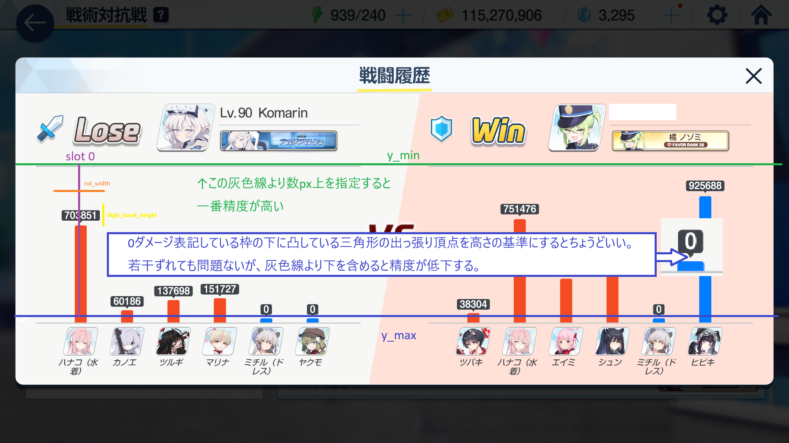
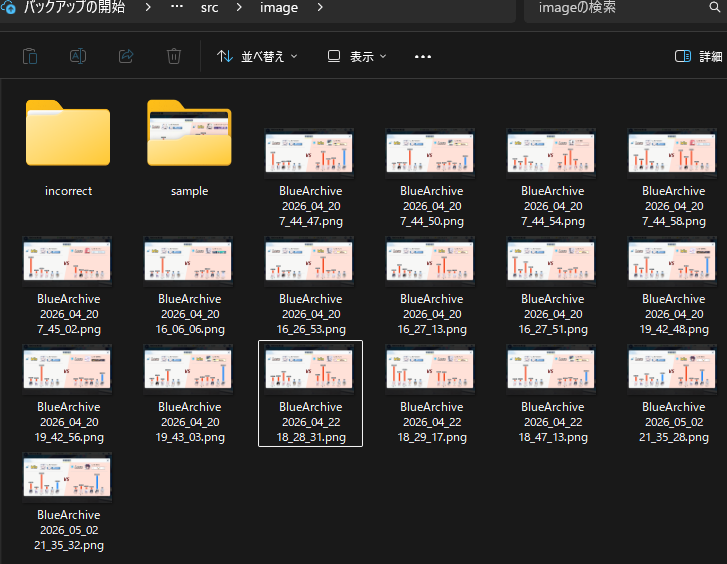

# OCR_DamageRead

ゲームのリザルト画面スクリーンショットからダメージ数値を自動読み取りするツールです。  
Tesseract OCR を用いて 12 スロット分の数値を並列処理し、`result.txt` に出力します。

---

## 動作環境

- Python 3.11 以上
- Windows 10 / 11（メイン開発・動作確認環境）
- Tesseract OCR 5.x（別途インストールが必要、後述）
- CUIでの実行、PowerShellで動作確認済み。

---

## セットアップ

### 1. Tesseract OCR のインストール

以下のページから Windows 用インストーラーをダウンロードしてインストールしてください。  
https://github.com/UB-Mannheim/tesseract/wiki

インストール時に **「Additional language data」→「Japanese」** にチェックを入れ、日本語モデル（`jpn.traineddata`）を同時にインストールしてください。

インストール先はデフォルト（`C:\Program Files\Tesseract-OCR\`）のままで問題ありません。  

### 2. Python パッケージのインストール

```
cd OCR_DamageRead
python -m venv .venv
.venv\Scripts\activate
pip install -r requirements.txt
```

---

## フォルダ構成

```
OCR_DamageRead/
├── .venv/
├── src/
│   ├── image/                  # 処理対象の画像を置くフォルダ
│   │   ├── sample/             # サンプル画像（処理対象外）
│   │   └── incorrect/          # エラー画像の自動保存先（自動生成）
│   ├── GT_text/                # GT モード用の正解ファイルを置くフォルダ
│   ├── OCR_DamageRead_v0.490.py
│   └── result.txt              # 出力結果（自動生成）
└── requirements.txt
```

> **注意**  
> `image/` 直下の `.png` / `.jpg` / `.jpeg` ファイルのみが処理対象です。  
> `image/sample/` のようなサブフォルダ内の画像は処理されません。

---

## 前提条件：解像度について

このツールは **フルスクリーン・16:9 の解像度(1920x1080)** で撮影されたスクリーンショットを前提としています。  
解像度が異なる場合、スロット座標がズレて数値を正しく読み取れません（エラーは表示されず、結果がおかしくなります）。

### 対応解像度以外でも動作させたい場合

初期設定クラスの下記の数値を変更してください。各与ダメ量のX座標のみ割合数値で、それ以外はピクセル単位なのはいずれ修正予定です。
```
    y_min:             int                = 400
    y_max:             int                = 770
    roi_width:         int                = 120
    digit_band_height: int                = 55

    def __post_init__(self):
        if self.slots is None:
            self.slots = [0.100, 0.160, 0.220, 0.280, 0.340, 0.400, 0.600, 0.660, 0.720, 0.780, 0.840, 0.900]
```
初期設定の座標調整例を下記に図示するので、これを元にカスタマイズをお願いします。


### ゲームの解像度設定方法

ゲーム内の設定メニューから **「画面モード：フルスクリーン」** かつ **「解像度：1920×1080（または他の 16:9）」** に設定してください。  
ウィンドウモードやボーダーレスの場合、OS のタスクバーなどが写り込むと座標がズレる場合があります。

---

## 使い方

### 基本的な使い方

1. 処理したいスクリーンショット（`.png` / `.jpg` / `.jpeg`）を `src/image/` に置く

2. スクリプトを実行する(下記リンクは実行プレビュー)
https://x.com/KoTiger_6295/status/2022640605495726469?s=20

```
cd src
python OCR_DamageRead_v0.485.py
```

3. 結果が `src/result.txt` に出力される

### 出力フォーマット

左チーム 6 人・右チーム 6 人のダメージ数値を以下の形式で出力します。  
数値は 10,000 で丸めた値です。

```
15.12.9.8.7.3 : 14.11.10.8.6.2
```

---

## 設定

`src/OCR_DamageRead_v0.490.py` の `初期設定クラス` の行を変更してください。  

```python
CONFIG = Config(
    debug_mode = False,   # True にするとデバッグウィンドウとCUI出力が有効になる
    output_txt = True,    # True にすると result.txt を出力する
    gt_mode    = False,   # True にすると GT ファイルと照合する
    gt_file    = os.path.join(_HERE, "GT_text", "GT_sample.txt"),
)
```

| 設定項目 | 説明 |
|---|---|
| `debug_mode` | `True` にするとスロットごとのデバッグウィンドウが表示され、ターミナルに詳細ログが出力される |
| `output_txt` | `True` にすると処理結果を `result.txt` に書き出す |
| `gt_mode` | `True` にすると `gt_file` に指定した正解ファイルと照合し、認識精度を集計する |
| `gt_file` | GT モード使用時の正解ファイルパス |

---

## デバッグモード

`debug_mode = True` にして実行すると、画像 1 枚ごとにデバッグウィンドウが表示されます。

- 各スロットの認識結果・信頼度・エラーコードを確認できます
- 認識が間違っていた場合は「間違い」を選択して正しい値を手動入力できます
- 「OK」ボタンで次の画像へ進みます

### エラーコード一覧

| コード | 色 | 意味 |
|---|---|---|
| `OCR_OK` | 緑 | 正常に認識できた |
| `GT_OK` | 緑 | 正解ファイルと一致した |
| `RECOVER_SUCCESS(DIGITS)` | 緑 | 桁欠損を補完して正解と一致した |
| `RECOVER_SUCCESS(VALUE)` | 緑 | 値の誤認識を修正して正解と一致した |
| `RECOVER_DIGITS` | 橙 | 桁欠損リカバリーが発動した（GT 未照合） |
| `RECOVER_VALUE_MISMATCH` | 橙 | 値リカバリーが発動した（GT 未照合） |
| `NO_DIGIT` | 橙 | 数字領域が検出できなかった |
| `NO_OCR` | 赤 | 数字帯は検出できたが OCR 結果が空 |
| `LEN_MISMATCH` | 赤 | 検出桁数と OCR 文字数が一致しない |
| `VALUE_MISMATCH` | 赤 | OCR は成功したが正解ファイルと不一致 |
| `RECOVER_FAILED(DIGITS)` | 赤 | 桁欠損リカバリーが失敗した |
| `RECOVER_FAILED(VALUE)` | 赤 | 値リカバリーが失敗した |

---

## GT モード（精度検証）

認識精度を数値で確認したい場合に使います。

1. `GT_text/` フォルダに正解ファイル（例: `GT_sample.txt`）を置く
2. `gt_mode = True` に設定し、`gt_file` を正解ファイルのパスに設定する
3. 実行すると処理終了後に不一致率が表示される

### 正解ファイルのフォーマット

画像 1 枚につき 1 行。左右チームのダメージを `.` 区切り、チーム間を ` : ` で区切ります。  
画像ファイルのファイル名昇順（大文字小文字を区別しない）と行順が一致している必要があります。

```
15.12.9.8.7.3 : 14.11.10.8.6.2
```

---

## よくある問題

**「Tesseract が見つかりません」と表示される**  
Tesseract がインストールされていないか、インストール先が標準パスと異なります。  
環境変数 `TESSERACT_CMD` に実行ファイルのフルパスを設定してください。

**「画像が見つかりません」と表示される**  
`src/image/` に `.png` / `.jpg` / `.jpeg` ファイルが存在するか確認してください。  
サブフォルダ内の画像は対象外です。

**結果の数値がすべて明らかにおかしい**  
画像の解像度が 16:9 でない可能性があります。ゲームの解像度設定を確認してください。  
詳細は「前提条件：解像度について」を参照してください。

**GT モードで「GT行数と画像枚数が一致しません」と表示される**  
`GT_text/` 内の正解ファイルの行数と `image/` 内の画像ファイル数が一致していません。  
どちらかが多い・少ない場合に発生します。

## License

This project is licensed under the MIT License.
